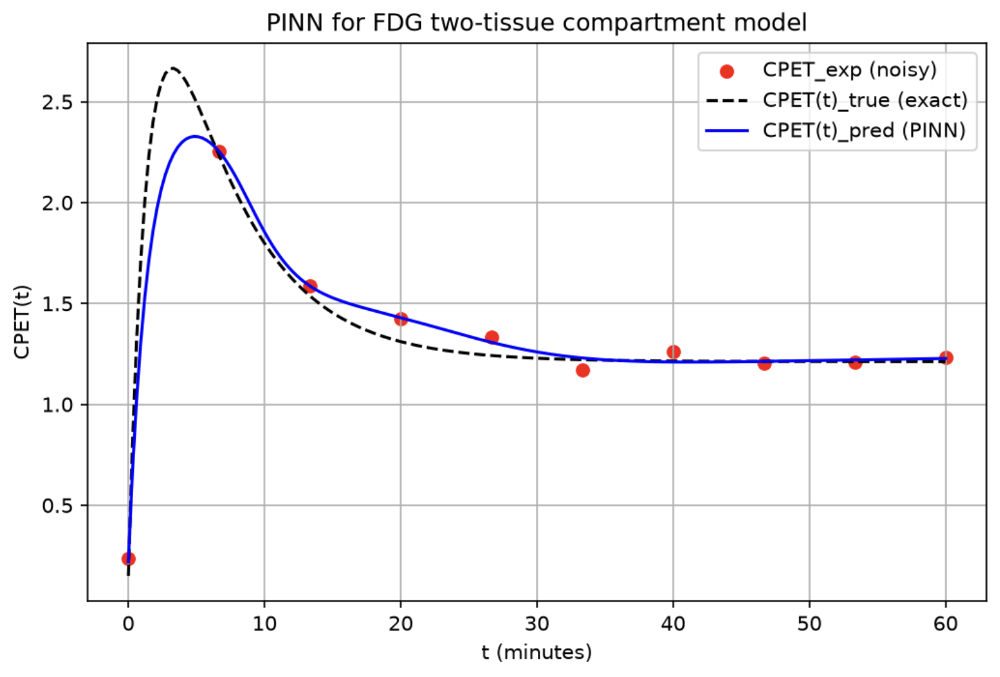

# Research question

Determine the BBB permeability (K1) from PET data using a Physics-Informed Neural Network (PINN) for the FDG tracer in the brain.

# Context

A patient is injected with a radioactive sugar tracer (here, FDG) and then enters a PET scanner, which takes repeated snapshots monitoring the radioactivity "flow" in the brain. FDG is a modified glucose molecule that, despite undergoing the same phosphorylation process as natural glucose and turning into FDG-6 (the molecule becomes attached to a phosphate group), is not continuously broken down for energy. When FDG is in its FDG-6 form, due to its new chemical structure, it cannot be further metabolized and thus becomes trapped in the neural cell.

Hence, PET can visualize the radioactivity level in each area of the brain after an interval \(t\). This "radioactivity signal" is given by the sum of:

- The tracer progressively injected in the blood and running towards the BBB.

This is known as the "plasma phase" and is indicated with Cp(t). It is the input of the whole system, the total FDG injected (minimal leakage is neglected). Cp(t) is known.

- The tracer crossing the BBB but not yet chemically trapped in brain cells.

This is known as the "free tissue phase" and is indicated with C1(t). Note that C1(t)K1 indicates the FDG that actually traces the BBB (where K1 is the rate of forward progression). Note that C1(t)k2 indicates the FDG that is leaving the brain and going back to the blood (where k2 is the rate of backward progression).

- The tracer that has been trapped (and accumulating) in the brain cells and thus is not leaving the brain anymore.

This is known as the "trapped tissue phase" and is indicated with C2(t). Note that C2(t)k3 indicates the FDG that is being trapped in the brain cells (where k3 is the rate of trapping). Note that C2(t)k4 indicates the FDG that is leaving the brain cells and going back to the free tissue phase (where k4 is the rate of untrapping). However in real tissue k4 is very slow and approximated to 0.

The explanation above is summarized by the following diagram:

```text
BLOOD              FREE TISSUE           TRAPPED TISSUE
Cp(t)   --K1-->      C1(t)      --k3-->     C2(t)
<--k2--                 <--k4--
```

Or, simplified as:

```text
BLOOD              FREE TISSUE           TRAPPED TISSUE
Cp(t)   --K1-->      C1(t)      --k3-->     C2(t)
<--k2--
```

The PET scanner cannot distinguish these three measurements, but rather sees them as combined in radioactivity in each area over time as a unique signal: CPET(t) for "combined PET over time".

In the most simplified form:

$$
C_{\mathrm{PET}}(t)=C_1(t)+C_2(t).
$$

All rates \(k\) are described as fractions of time because they describe movement between tissue compartments already inside the BBB. \(K_1\) describes movement from blood to brain tissue across the BBB, which involves two physically different spaces that do not have comparable units. \(C_p(t)\) is the plasma concentration (tracer/blood volume), whereas \(C_1(t)\) is the tissue concentration (tracer/tissue volume). Understanding how to complete this unit transition comes more naturally by looking at the equations describing the motion of FDG across the different phases mentioned.

Considering that Cp(t) is known, the system of ODEs describing the motion of FDG across the different phases refers to the unknown C1(t) and C2(t), given by:

$$
\frac{dC_1}{dt}=K_1C_p(t)-k_2C_1(t)-k_3C_1(t)+k_4C_2(t).
$$

The four terms describe tracer arriving from blood, leaving for blood, entering the trapped pool, and returning from the trapped pool, respectively.

$$
\frac{dC_2}{dt}=k_3C_1(t)-k_4C_2(t).
$$

The two terms describe tracer arriving from the free compartment and leaving for the free compartment, respectively.

Among the four rates (\(K_1\), \(k_2\), \(k_3\), and \(k_4\)), the one describing BBB permeability is \(K_1\). The others describe the flux of FDG across the brain-tissue compartments, which is not of interest for the purpose of this work. Hence, the goal is to estimate \(K_1\) from the known PET signal \(C_{\mathrm{PET}}(t)\).

# Purpose

Recover the unknown K1 (and k2, k3, k4) from the known CPET(t) using a Physics-Informed Neural Network (PINN).

```python
import torch
import torch.nn as nn
import numpy as np
import matplotlib.pyplot as plt
```

Graph the progression of BBB permeability over time.

# Generate synthetic data to imitate experimental PET data

Noise is also added so that the data do not look perfect.

## Physical parameters

Physics parameters existing only to generate "real" data. These are the "experimental real" values obtained by the PET scanner using appropriate physics nomenclature.

```python
k1_real = 0.89  # Forward rate from blood to free tissue (BBB permeability)
k2_real = 0.122  # Backward rate from free tissue to blood
k3_real = 0.057  # Forward rate from free tissue to trapped tissue
k4_real = 0.0   # Backward rate from trapped tissue to free tissue
```

These values were taken from the following paper: "Tomographic measurement of local cerebral glucose metabolic rate in humans with (F-18)2-fluoro-2-deoxy-D-glucose: validation of method" These values are unknown to the scientist when performing the PINN analysis.

The Cp(t) value is known. In fact the PET raw output is a 4D image, meaning a 3D space, changing over time, t. If you select a single voxel, you can see the time evolution of the radioactivity in that voxel, which is the CPET(t) value, the combined PET signal, mentioned previously. On the other hand, the Cp(t) is the plasma concentration of the FDG tracer in the blood (the injected sugar and input of the system). In a medical context the Cp(t) is obtained through periodic blood sampling, which is invasive and not always feasible. Or, through an image-derived input function (IDIF) from the PET images themselves, which is less invasive but more complex and less accurate. The latter would mean having in the PET scan also a large blood vessel (such as the aorta or a heart chamber) visible and selecting a voxel in them, treating its CPET(t) as the Cp(t) of the system. However, this is not always possible, and even when it is, the IDIF is not very accurate. Usually the first option (blood sampling) is adopted in combination with the Feng model. The Feng formula is a curve-fitting model that describes the time course of the plasma input function (Cp(t)) for FDG in humans. It is based on a sum of exponentials and is widely used in PET studies to model the plasma input function. Using the Feng model makes it possible to transform those scattered blood samples data points (or IDIF), into a smooth mathematical function that can be used in the ODEs describing the FDG motion across the brain tissue compartments. Since for this synthetic data generation we are not interested in the Cp(t) accuracy, we will use a simple function to generate it, which is not realistic but serves the purpose of this work. In fact, it could be possible to use examples of sample blood measurements and then apply the Feng model, but given the complexity of the 7-parameter Feng model, it is not necessary for the purpose of this work, which wants to focus on something different (e.g. BBB permeability).

Here, to generate a plausible known fake Cp(t) curve (to then generate CPET(t) data through the ODEs) we will use the following simple single exponential equation:

$$
C_p(t)=C_{p,0}\exp\left(-\frac{t}{\tau_p}\right).
$$

where Cp0 is the initial plasma concentration of the tracer, and tau is a time constant that controls how quickly the concentration decays over time. Let us assume:

```python
Cp0 = 3.0      # peak plasma concentration right after injection
tau_p = 1.5    # how fast it clears, in minutes
```

```python
def Cp(t):
    return Cp0 * np.exp(-t/tau_p)
```

At this point we can generate the synthetic "experimental" data for C1(t) and C2(t) by solving the ODEs numerically using the known Cp(t) and the real k values. From them (Cp(t),C1(t),C2(t)) we will calculate the CPET(t) signal and add some noise to simulate experimental measurements. So, first step, calculate the "true solution", or "un-noisy" CPET(t) signal (CPET_true(t)), by solving the ODEs numerically. Then, add some noise to simulate experimental measurements (CPET_exp(t)) The latter is what would actually be handed to the PINN if I would be using real PET data, from which will then try to recover the unknown K1 value.

To calculate CPET_true(t), let us calculate C1(t) and C2(t) since CPET(T)=C1(t)+C2(t). I mentioned previously that to calculate Cp0 could also have been used the selection of CPET(t) for a major blood vessel. However, while it is difficult to get a voxel with only a major blood vessel, it is hard not to get smaller blood vessels (capillaries) in the voxel. This means that in a PET voxel there cannot be only pure tissue, but also vessels. Why does this matter since the scanner only sees FDG? It matters because the scanner detects radioactive decay and the scanner cannot tell if the decay is happening because of an FDG molecule decaying in a brain cell or in the blood passing through the vessel (since the FDG was injected in the blood first, that now is circulating across the body) This means that when you select a voxel, you select both brain tissue and capillaries, meaning that you are not measuring the FDG flux only across the brain tissue, but also across the blood (which is not of medical interest). This is why, to make CPET(t) accurate, a fixed parameter Vb (Vassel blood) should be included in the CPET(T) equation. Hence, CPET(t) equation would become:

$$
C_{\mathrm{PET}}(t)=V_bC_p(t)+(1-V_b)\left[C_1(t)+C_2(t)\right].
$$

where we can assign a value to Vb of:

```python
Vb=0.05 #since it usually sits between 0.03 and 0.05
```

Now let us calculate C1 and C2 to find CPET_true(t):

Generate some time points

```python
t_min, t_max = 0.0, 60.0 #since a usual FDG brain scan runs for about an hour.
dt=0.001
t_syn=np.arange(0,t_max+dt,dt) #np.arange(start,stop+step,step) so that it stops at "stop".
```

Moving forward at very small steps, each 0.001 minutes apart from 0 to 60 minutes.

Note that, in

$$
\frac{dC_1}{dt}=K_1C_p(t)-(k_2+k_3)C_1(t)+k_4C_2(t),
$$

to calculate (C_1), we need to know how quickly (C_1) is changing, that is, (dC_1/dt). However, to know (dC_1/dt), we need to know (C_1). The only known value is (C_1(0)=0), because there has been no injection yet. Note that (C_1(t)) is the accumulated result of the small changes (dC_1/dt) added together over time, starting from (t=0).

At (t=0):

$$
\frac{dC_1}{dt}=K_1C_p(t)-(k_2+k_3)(0)+k_4(0),
$$

because both (C_1) and (C_2) are zero, and

$$
\frac{dC_2}{dt}=k_3(0)-k_4(0)=0.
$$

From these equations, we calculate (dC_1/dt) and (dC_2/dt). At (t+\Delta t=0+0.001):

$$
C_1(t+\Delta t)=C_1(t)+\Delta t\frac{dC_1}{dt},
$$

$$
C_2(t+\Delta t)=C_2(t)+\Delta t\frac{dC_2}{dt}.
$$

Using the new (C_1(t+\Delta t)) and (C_2(t+\Delta t)), we calculate the updated derivatives. These derivatives are then used to calculate (C_1(t+2\Delta t)) and (C_2(t+2\Delta t)), and the process continues in the same way.

Summarizing steps:

1. Use the initial condition t=0, C1(0)=0 and C2(0)=0, to calculate the first rate dC1/dt and dC2/dt after t=0.

2. Use this rate to calculate (C_1(t+\Delta t)) and (C_2(t+\Delta t)), which are given by their previous values plus the changes \(\Delta t(dC_1/dt)\) and \(\Delta t(dC_2/dt)\), respectively.

3. Use these values of C1(t+dt) and C2(t+dt) to calculate the subsequent rates dC1/dt and dC2/dt after t=t+dt.

4. Use the rate known to calculate the new C1 and C2 ecc...

So, given the initial C1 and C2, I can calculate the rate. Known the rate, I can calculate the subsequent C1 and C2. Known the subsequent C1 and C2, I can calculate the new rate, ecc... First exact values, then calculation of the rate. This procedure should continue until you reach t+ndt=t+max, where you will get the final cumulative C1(t_max) and C2(t_max).

```python
C1_syn=np.zeros_like(t_syn)
C2_syn=np.zeros_like(t_syn)
```

where np.zeros_like creates a new array the same length as t_syn (one slot per time point) and fills every slot with 0.0. Hence, we are sure that C1(t) and C2(t) at t=0 are equal to 0.

Now the compiled loop must be created:

```python
for i in range(1, len(t_syn)): #skipping the initial condition at 0, that is already correct because equal to zero.
```

use len so that it indicates positions in the array and not values STEP 1: Use initial condition + calculate the rate

```python
    t_prev=t_syn[i-1] #that is t_syn[0]=0
    C1_prev= C1_syn[i-1] #that is C1_syn[0]=0
    C2_prev=C2_syn[i-1] #that is C2_syn[0]=0
```

```python
    Cp_now= Cp(t_prev) #Cp was already defined previously
```

Now, compute the two rates (dC1/dt, dC2/dt), using only currently-known values.

```python
    dC1_dt= k1_real*Cp_now - (k2_real+k3_real)*C1_prev+k4_real*C2_prev
    dC2_dt= k3_real*C1_prev-k4_real*C2_prev
```

STEP 2: Use the rate to calculate the new C1 and C2

```python
    C1_syn[i]=C1_prev+dt*dC1_dt
    C2_syn[i]=C2_prev+dt*dC2_dt
```

These new values of `C1_syn` and `C2_syn` will then be used to update the rates. For example, when `i=4`, $C_{1,\mathrm{syn}}[4]=C_{1,\mathrm{syn}}[3]+\Delta t(dC_1/dt)$. This is the updated value of (C_1), calculated using the new rate.

Hence, the final C1 and C2 at t_max:

```python
C1_tmax= C1_syn[-1] #last element of the array
C2_tmax= C2_syn[-1]
```

```python
print(f"C1(t_max=60) = {C1_tmax:.6f}") #with 6 decimal figures
print(f"C2(t_max=60) = {C2_tmax:.6f}") 
```

Here, we simulated a grid of t_syn of 60,001 points for accuracy. However in a real PET scan there are only a limited number of useful snapshotss, and here it is pretended to have only 10 of them.

```python
N_data = 10
t_data = np.linspace(t_min, t_max, N_data)
```

generates a sequence of evenly spaced numbers over a specified interval, controlled primarily by a start value, a stop value, and the total number of points.

```python
C1_data = np.interp(t_data, t_syn, C1_syn)
C2_data = np.interp(t_data, t_syn, C2_syn)
```

here np.interp wants to take for each of the 10 points in t_data, the two t_syn values that are closestt to it (one just below, one just above) and interpolate its C1 or C2. For example t_data is 6.5, so you take the C1 at t_syn=6.499 and t_syn=6.501 and by interpolating their C1 (in this example perfect average because it is exactly in the middle, but more generally, it is a weighted average), you find the C1 at t_data.

Now, combine the C1_data and C2_data calculated into the CPET_true(t) "un-noisy"

```python
CPET_true = Vb * Cp(t_data) + (1 - Vb) * (C1_data + C2_data)
print(f"\nCPET_true at each t_data point:\n{np.round(CPET_true, 5)}")
```

not continuous

Now, add noise to CPET_true to find CPET_exp:

```python
np.random.seed(0)  # For reproducibility (repeatable output)
```

It is a starting number used to initialize a pseudo-random number generator Because NN weights are initialized randomly before training begins. Without seed: If your model performs well today, you might run it tomorrow and get worse results just because of a different random starting point. With seed: You can reproduce your exact metrics, training loss curves, and final model weights every single run.

```python
noise_level = 0.05 #this indicates how large the fake measurement is.
CPET_exp = CPET_true + noise_level * np.random.randn(N_data)
```

np.random.randn(N_data) draws numbers from a normal distribution (bell curve). Hence, np.random.randn(N_data) takes N_data=10 random numbers on the bell curve and then multiplies by the noise to then add it to the real CPET. The reason why the bell curve values are multiplied by the noise comes from the fact that real measurement errors (e.g. PET scanner) are often not given by single glitches, but rather by the sum of many tiny independent sources of error that pile up. According to the Central Limit Theorem, whenever you add up many small independent random effects, the result tends to form a bell curve, even if the individual effects were not bell shaped themselves. This makes the noise added more realistic.

NB. Real PET data usually follow a Poisson distribution, but for large counts, it is very similar to the Gaussian bell curve, making the simplification very reasonable.

```python
print(f"CPET_exp  at each t_data point:\n{np.round(CPET_exp, 5)}")
print("\n(CPET_exp is what would actually be handed to the PINN if using real PET data)")
```

Hence, we have now calculated both the experimental data CPET_exp that will be used for the PINN, and the real exact one that will be used for comparison to see the accuracy of the physics equations in combination with the experimental data in the PINN.

Convert t_data and CPET_exp used to train the PINN into tensors because PyTorch needs its own tensor version of the data to train:

```python
t_data_tensor = torch.tensor(t_data, dtype=torch.float32).view(-1, 1)
CPET_data_tensor = torch.tensor(CPET_exp, dtype=torch.float32).view(-1, 1)
```

do the same for Cp since it gets called later inside physics_loss where autograd wants everything in torch:

```python
def Cp_torch(t):
    return Cp0 * torch.exp(-t/tau_p)
```

PINN checking whether its predictions obey the ODEs.

```python
N_colloc = 200 #200 collocation points
t_colloc = np.linspace(t_min, t_max, N_colloc) #choose these collacation points within the PET interval
t_colloc_tensor = torch.tensor(t_colloc, dtype=torch.float32).view(-1, 1)
```

Build a collocation tensor so that the PINN can verify for other 200 random points in the time interval if the ODEs are followed. In fact, for the previous 10 points chosen, the PINN checks if its predicted PET signals match the "experimental" ones. However, when data are missing experimentally (we have only 10), the PINN needs to verify that between the measurements the ODEs are respected. It will be shown later why this is useful when calculating the physics loss.

# Define the model

This section defines the NN structure: it is sequentially adding 2 hidden layers with 32 neurons (nodes). This Python code defines and creates a Multi-Layer Perceptron (MLP)

```python
class PINN(nn.Module): #nn.Module is the basic parent class for all NN.
    def __init__(self, n_hidden=32):
        super(PINN, self).__init__() #This allows PyTorch to find, store, differentiate, and optimize all the NN weights.
        self.net = nn.Sequential( #nn sequential constructs a pipeline of layers so that the output of each operation becomes the input of the subsequent one.
```

The input layer of the PINN becomes the first hidden layer. The network receives one input number (e.g. time) and sends it to `n_hidden=32` neurons, creating 32 output features from one input feature. Every neuron calculates \(z_j=w_jt+b_j\). PyTorch creates and learns:

- 32 weights, because each of the 32 neurons receives one input.

- 32 biases, one for each neuron.

```python
            nn.Linear(1, n_hidden), #FIRST HIDDEN LAYER
```

then apply the tanh activation function to the output of each of the 32 neurons separately. tanh converts each output to a number between -1 and 1, while introducing nonlinearity so that the network can represent curved concentration trajectories (not only straight lines).

```python
            nn.Tanh(), #TANH TRANSFORMATION FOR FIRST H.L
```

The next layer receives 32 numbers from the first hidden layer (tanh) and produces 32 new numbers. Each of the 32 neurons receives all 32 previous values. PyTorch creates and learns:

- 32 × 32 = 1,024 weights. #each of the 32 neurons received the previous values and the new 32 numbers generated by the second hidden layer.

- 32 biases.

```python
            nn.Linear(n_hidden, n_hidden), #SECOND HIDDEN LAYER
```

Apply tanh to the 32 values produced by the second hidden layer

```python
            nn.Tanh(), #TANH TRANSFORMATION FOR SECOND H.L
```

This layer receives the 32 hidden values and produces two outputs: (1) C1(t)_pred (2) C2(t)_pred

```python
            nn.Linear(n_hidden, 2) #OUTPUT LAYER, <- 2 outputs: C1 and C2
        )
```

```python
    def forward(self, t):
```

forward defines how the input data travels through the network. Specifically, it passes the time values through every operation in self.net: t -> Linear -> Tanh -> Linear -> Tanh -> Linear -> out

```python
        out = self.net(t)          # shape (batch, 2)
        C1 = out[:, 0:1]            # first column -> C1 (this specific notation is used to keep its two-dimensional shape)
        C2 = out[:, 1:2]            # second column -> C2
        return C1, C2
```

the output will look like this 2D array for example times: column 0       column 1 C1              C2 time 0        [ C1(0),         C2(0)  ] time 10       [ C1(10),        C2(10) ] time 20       [ C1(20),        C2(20) ]

```python
model = PINN(n_hidden=32) #both hidden layers contain 32 neurons.
```

The training of the weights will be shown further on. At this point, PyTorch is generating all the initial weights and biases. The training will then change them.

Here, the overall structure is summarized the overall structure: Input t (time) 1 number │ ▼ First hidden layer 32 neurons │ tanh │ ▼ Second hidden layer 32 neurons │ tanh │ ▼ Output layer 2 numbers │ ├── C1(t) └── C2(t)

NOW YOU NEED AN AUTOMATIC DIFFERENTIATIOR

```python
def derivative(y, x):
```

Compute the derivative of y with respect to x using autograd from torch y, x must be tensors with requires_grad=True for x

```python
    return torch.autograd.grad(
        y, x, 
```

y is the quantity being differentiated (in this case C1_pred, C2_pred) x is the variable with respect to which y is differentiated (in this case, time t)

```python
        grad_outputs=torch.ones_like(y), #creation of a tensor of 1s with the same shape as y to return the derivative at every t.
        create_graph=True
    )[0]
```

This will allow to calculate easily the derivatives of C1_pred and C2_pred. derivative(C1_pred, t) -> dC1/dt derivative(C2_pred, t) -> dC2/dt

Note that the purpose of this work is to calculate the BBB permeability (K1), knowing that all K1,k2,k3, and k4 are unknown. Hence, the goal is to recover these kinetic rates from the experimental PET data and each of them must behave as a NN weight. These weights are indicated as k1_raw, k2_raw, k3_raw, and k4_raw and are constantly optimized. These kinetic values cannot be negative, that is why softplus is used:

```python
k1_raw = torch.nn.Parameter(torch.tensor([0.0]))
k2_raw = torch.nn.Parameter(torch.tensor([0.0]))
k3_raw = torch.nn.Parameter(torch.tensor([0.0]))
k4_raw = torch.nn.Parameter(torch.tensor([0.0]))
softplus = nn.Softplus() #softplus(x) = log(1 + exp(x))
```

```python
def get_rates():
    return (
        softplus(k1_raw),
        softplus(k2_raw),
        softplus(k3_raw),
        softplus(k4_raw)
    )
```

The latter function return the physical rates used in the differential equations.

# Define the loss components (PINN)

Remember that the PINN predicts (C_{1,\mathrm{pred}}(t)) and (C_{2,\mathrm{pred}}(t)) from the provided (C_{\mathrm{PET,exp}}(t)). The PINN is trained on three kinds of error:

1. **Data loss:** reproduce what the PET scanner measured. For each of the 10 measurements, the difference is calculated between the predicted PET signal

   $$
   C_{\mathrm{PET,pred}}=V_bC_p(t)+(1-V_b)(C_{1,\mathrm{pred}}+C_{2,\mathrm{pred}})
   $$

   and the experimental (C_{\mathrm{PET,exp}}). In a nutshell, the squared error is calculated from (C_{\mathrm{PET,pred}}-C_{\mathrm{PET,exp}}).

2. **ODE-physics loss:** obey the ODE kinetic equations. Here, $C_{1,\mathrm{pred}}(t)$ and $C_{2,\mathrm{pred}}(t)$ are differentiated to calculate their time derivatives. These are compared against the derivatives obtained from the ODEs mentioned previously. This loss uses the 200 collocation points and follows the same steps described above for the 10 PET points. This is useful for checking the "path" between observations. Without these points, the model might fit the observations while taking an arbitrary or unphysical path between them.

3. **Initial-condition loss:** start from the correct physical state. Here, the squared error is calculated between the initial conditions predicted by the neural network and those observed experimentally: $C_{1,\mathrm{pred}}(0)-0$ and $C_{2,\mathrm{pred}}(0)-0$.

Thus, through these three data losses we measure both the 10 PET data points, but also the data predicted in between.

```python
def physics_loss(model, t):
    t.requires_grad_(True)
    C1_pred, C2_pred = model(t)
```

```python
    dC1_dt_pred = derivative(C1_pred, t)
    dC2_dt_pred = derivative(C2_pred, t)
```

```python
    cp_t = Cp_torch(t)
    k1_p, k2_p, k3_p, k4_p = get_rates()
```

the two equations, using the LEARNABLE rate guesses instead of the real (unknown-to-the-model) k1_real, k2_real, k3_real, k4_real

```python
    dC1_dt_true = k1_p*cp_t - (k2_p+k3_p)*C1_pred + k4_p*C2_pred
    dC2_dt_true = k3_p*C1_pred - k4_p*C2_pred
```

```python
    loss_ode = torch.mean((dC1_dt_pred - dC1_dt_true)**2) \
             + torch.mean((dC2_dt_pred - dC2_dt_true)**2)
    return loss_ode
```

```python
def initial_condition_loss(model):
    t0 = torch.zeros(1, 1, dtype=torch.float32, requires_grad=False)
    C1_pred_0, C2_pred_0 = model(t0)
    return C1_pred_0.pow(2).mean() + C2_pred_0.pow(2).mean()
```

```python
def data_loss(model, t_data, CPET_data):
```

the network predicts C1, C2 separately, but the DATA is CPET (the combined signal), so we combine the predictions the same way, using the known Vb and Cp(t), before comparing to CPET_data

```python
    C1_pred, C2_pred = model(t_data)
    cp_t = Cp_torch(t_data)
    CPET_pred = Vb*cp_t + (1-Vb)*(C1_pred + C2_pred)
    return torch.mean((CPET_pred - CPET_data)**2)
```

# Training setup

```python
optimizer = torch.optim.Adam(
    list(model.parameters()) +
    [k1_raw, k2_raw, k3_raw, k4_raw],
    lr=0.005
)
```

Here, lr is the learning rate. This controls the step size taken during each update. This selects Adam, one of the most popular optimization algorithms in deep learning. model.parameters(): This hands all the trainable weights and biases in your neural network over to the optimizer so it knows what to adjust.

Hyperparameters for weighting the loss terms WEIGHTS

```python
lambda_data = 20.0  #upweighted since there are only 10 sparse points to anchor the fit
lambda_ode = 1.0
lambda_ic = 1.0
```

can be written manually for a baseline attempt, but then you can write a softadapt/self-adaptive PINN.

For logging

```python
num_epochs = 6000 #number of iterations to train the model, the higher the value, the more is the accuracy.
print_every = 500 #printing once in every 500 iterations.
```

Num epochs: you usually set a high epoch count and let a technique called Early Stopping decide when to halt. VALIDATION LOSS: As long as validation loss is decreasing, the model is learning. When validation loss stops improving and begins rising while training loss keeps dropping, your model is just memorizing the training data. You set a "patience" threshold (e.g., 10–20 epochs). If validation loss doesn't improve for that many epochs, stop automatically and restore the best weights.

# Training loop

```python
model.train() #set the model to training mode
for epoch in range(num_epochs):
    optimizer.zero_grad() #clear the gradients from the previous step
```

```python
    l_data = data_loss(model, t_data_tensor, CPET_data_tensor)
    l_ode = physics_loss(model, t_colloc_tensor)
    l_ic = initial_condition_loss(model)
```

Combine losses with weights

```python
    loss = lambda_data*l_data + lambda_ode*l_ode + lambda_ic*l_ic
```

Backpropagation: central mathematical algorithm that allows a neural network to learn from its errors.

```python
    loss.backward() #compute gradients
    optimizer.step() #update weights
```

Backpropagation works out who in the network was responsible for a mistake, and by how much.

Logging - Print progress

```python
    if (epoch+1) % print_every == 0:
        k1_p, k2_p, k3_p, k4_p = get_rates()
        print(f"Epoch {epoch+1}/{num_epochs}, Loss={loss.item():.6f}, "
              f"k1={k1_p.item():.4f}, k2={k2_p.item():.4f}, "
              f"k3={k3_p.item():.4f}, k4={k4_p.item():.4f}")
```

```python
k1_f, k2_f, k3_f, k4_f = get_rates()
print(f"\nTrue values:      k1={k1_real}, k2={k2_real}, k3={k3_real}, k4={k4_real}")
print(f"Recovered values: k1={k1_f.item():.4f}, k2={k2_f.item():.4f}, "
      f"k3={k3_f.item():.4f}, k4={k4_f.item():.4f}")
```

How the training looks like for 1/6000 epochs: Network predicts C1 and C2 ↓ Losses measure the mistakes ↓ Backpropagation finds which weights caused the mistakes ↓ Optimizer adjusts the network weights and K1, k2, k3, k4 ↓ Network makes improved predictions Hence, the losses are outside the network, judge its outputs, and provide the information needed to correct its weights and kinetic rates.

TWO-STEP CYCLE: Forward Pass: Input data flows forward through the network layers to produce a prediction, and the loss function computes a single number saying how wrong that prediction was. Backward Pass (Backpropagation): The error flows backward through the network. Using the calculus chain rule, PyTorch calculates the gradient—the direction and magnitude to tweak each weight to reduce the loss—starting from the output layer back to the input.

By plotting, see how good the model made its predictions.

# Answer to the research question

Obtain the final positive kinetic parameters estimated by the PINN.

```python
k1_final, k2_final, k3_final, k4_final = get_rates()
```

Convert the PyTorch tensors into ordinary Python numbers.

```python
k1_value = k1_final.detach().item()
k2_value = k2_final.detach().item()
k3_value = k3_final.detach().item()
k4_value = k4_final.detach().item()
```

```python
print("\n" + "=" * 60)
print("FINAL KINETIC PARAMETERS ESTIMATED BY THE PINN")
print("=" * 60)
```

```python
print(f"K1 = {k1_value:.4f}  (blood → free brain tissue)")
print(f"k2 = {k2_value:.4f}  (free brain tissue → blood)")
print(f"k3 = {k3_value:.4f}  (free → phosphorylated tissue)")
print(f"k4 = {k4_value:.4f}  (phosphorylated → free tissue)")
```

```python
print("\n" + "=" * 60)
print("ANSWER TO THE RESEARCH QUESTION")
print("=" * 60)
```

```python
print(
    f"The PINN-estimated value of K1 is {k1_value:.4f}. "
    "K1 represents the blood-to-brain tissue FDG influx rate "
    "and is the kinetic parameter used in this model to characterize "
    "FDG transport across the blood-brain barrier (BBB)."
)
```

```python
print(
    f"Therefore, the estimated BBB FDG permeability/transport parameter "
    f"for this synthetic PET dataset is K1 = {k1_value:.4f}."
)
```

# Final graph

```python
model.eval()
t_plot = np.linspace(t_min, t_max, 200).reshape(-1, 1).astype(np.float32)
t_plot_tensor = torch.tensor(t_plot, requires_grad=True)
with torch.no_grad():
    C1_pred_plot, C2_pred_plot = model(t_plot_tensor)
C1_pred_plot = C1_pred_plot.numpy()
C2_pred_plot = C2_pred_plot.numpy()
CPET_pred_plot = Vb*Cp(t_plot) + (1-Vb)*(C1_pred_plot + C2_pred_plot)
```

```python
C1_true_plot = np.interp(t_plot.flatten(), t_syn, C1_syn)
C2_true_plot = np.interp(t_plot.flatten(), t_syn, C2_syn)
CPET_true_plot = Vb*Cp(t_plot.flatten()) + (1-Vb)*(C1_true_plot + C2_true_plot)
```

```python
plt.figure(figsize=(8, 5))
plt.scatter(t_data, CPET_exp, color='red', label='Noisy CPET data')
plt.plot(t_plot, CPET_true_plot, 'k--', label='True CPET(t)')
plt.plot(t_plot, CPET_pred_plot, 'b', label='PINN CPET(t)')
plt.xlabel('t (minutes)')
plt.ylabel('CPET(t)')
plt.legend()
plt.title('PINN for FDG two-tissue compartment model')
plt.grid(True)
```

```python
from pathlib import Path
```

```python
plot_path = Path(__file__).resolve().parent / "fdg_final.png"
plt.savefig(plot_path, dpi=150, bbox_inches="tight")
print(f"Saved plot to: {plot_path}")
```

{#fig-fdg-final width=90% fig-align="center"}
